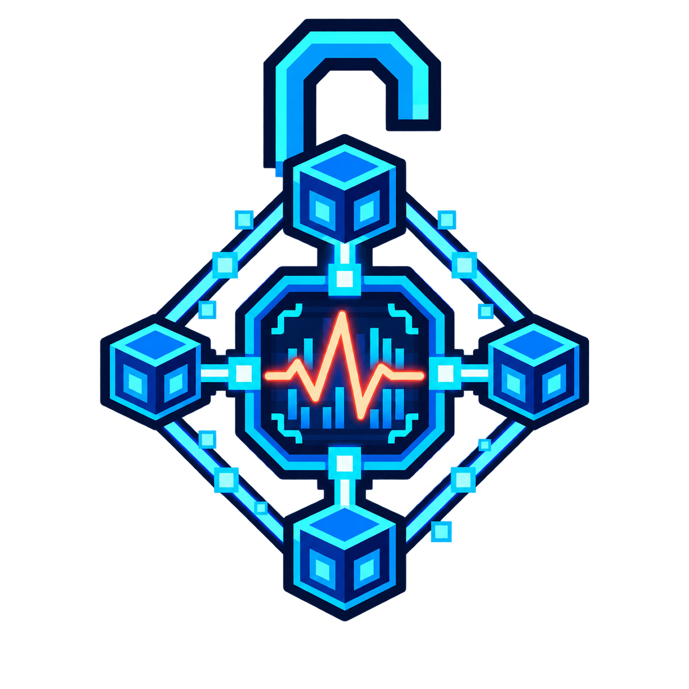

# No More Admin AE2 Network Analyser



A small NeoForge 1.21.1 compatibility mod that allows non-operator players to
use the tick rate profiler from AE2 Network Analyser.

## Requirements

- Minecraft 1.21.1
- NeoForge 21.1.1 or newer for Minecraft 1.21.1
- AE2 Network Analyser `1.21-2.1.5-neoforge`
- Install this mod and AE2 Network Analyser on both the dedicated server and
  every connecting client.

The dependency is declared as required. NeoForge will show a dependency error
instead of silently loading this patch when AE2 Network Analyser is missing.

## Behaviour

The upstream mod gates only the tick profiler request behind an operator check.
This mod changes that one permission decision to allow every connected player.
It does not modify the analyser UI, profiling implementation, network packets,
AE2 network data, or any unrelated Minecraft permissions.

The Mixin target is intentionally strict. If a future AE2 Network Analyser
release changes the target method, startup/build verification should fail so
compatibility can be reviewed before updating the declared dependency version.

## Building

Use Java 21 and run:

```text
./gradlew build
```

The JAR is written to `build/libs/`. GitHub Actions builds the project on each
push and pull request, and also supports manual runs from the Actions tab.

## Reference

Implemented against GlodBlock/ExtendedAE branch
`analyser/1.21.1-neoforge`, commit
`f59a634fc583ea7361bbb61e2ac51ae22a80988b`.

No upstream source code is bundled in this project.
